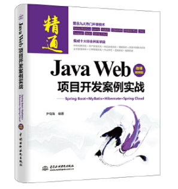
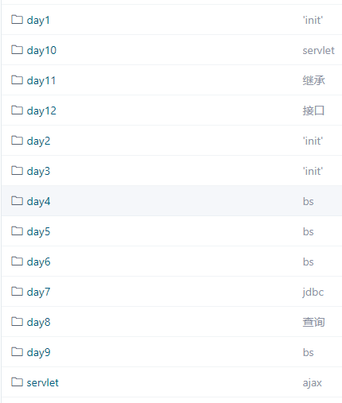
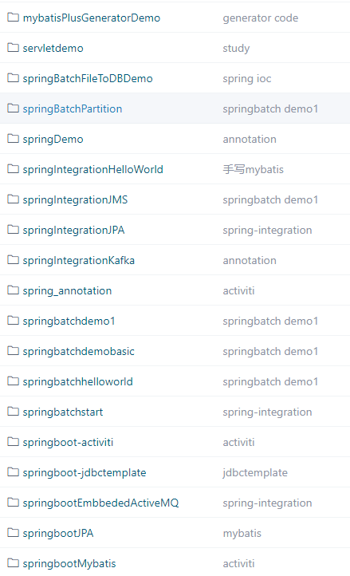

# 潘多编程

#### 作者介绍
> 你好，我是[《Java Web 项目开发案例实战—Spring Boot+Mybatis+Hibernate+Spring Cloud》](https://blog.csdn.net/h356363/article/details/122229485) 图书作者，当当，京东，淘宝，新华书店都可以找到这本书。

- 个人博客地址：https://blog.csdn.net/h356363?type=blog

- 个人邮箱 bseayin@aliyun.com

- 个人公众号：

#### 项目介绍
把本人学习的笔记和源码都集中到这个项目中，方便自己，也方便大家快速查看。
#### 目录

##### 1. 《Java Web 项目开发案例实战—Spring Boot+Mybatis+Hibernate+Spring Cloud》图书源码 
     - 1.1 [码云 ](https://gitee.com/bseaworkspace/springbootbookcode)
     - 1.2 [gethub ](https://github.com/bseayin/springbootbookcode)
##### 2.  [Java 基础入门](http://https://gitee.com/bseaworkspace/zzjavabase)

##### 3. [SpringBoot 学习](https://gitee.com/bseaworkspace/springall)
- [SpringBoot 最简单的搭建](https://blog.csdn.net/h356363/article/details/90523071)
- [博客 SpringBoot2 学习10 Controller接收参数的方式](https://blog.csdn.net/h356363/article/details/90510609)
- [深入学习Spring IOC和AOP 实例代码](https://blog.csdn.net/h356363/article/details/113477919)

- [基于springboot2的源码学习](https://gitee.com/bseaworkspace/study_java_web)

##### 4.  [uni-app学习](https://blog.csdn.net/h356363/category_9411281.html)

- [记一次完整的uni-app微信小程序开发到上线过程](https://blog.csdn.net/h356363/article/details/108550333)
- [uni-app 系列 四 微信小程序 获取用户微信信息 open id](https://blog.csdn.net/h356363/article/details/102711967)
- [uni-app 系列 三 微信小程序 网上商城实现演示](https://blog.csdn.net/h356363/article/details/102652516)
